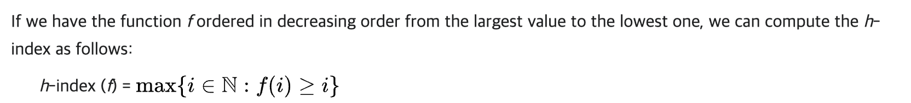

## 문제 풀이

개인적인 생각으론 문제 지문의 워딩이 친절하지 않다고 느꼈습니다. H-Index의 정의를 파악하는 것이 가장 어려웠던 것 같습니다(실제 정렬은 기본 `sort()`만 사용할 정도로 간단).

[1, 10, 11]과 같은 경우 h값은 1이 아니라 2 입니다. 2번 이상 인용된 논문이 (10회, 11회) 총 2편이 있기 때문에 2가 최댓값이 됩니다.

> [1,10,11] return 2

> [10,11] return 2

> [0,0,0,0,0] return 0

## Tip
